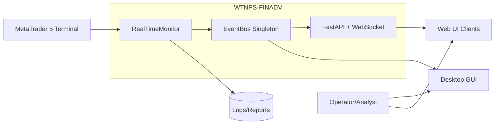
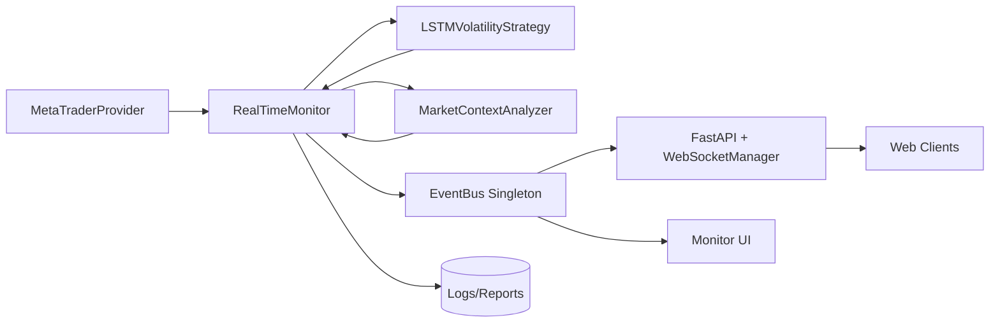
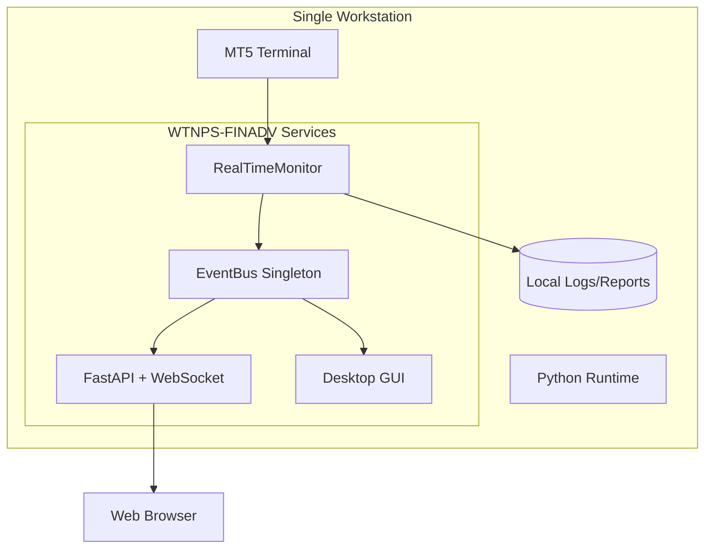
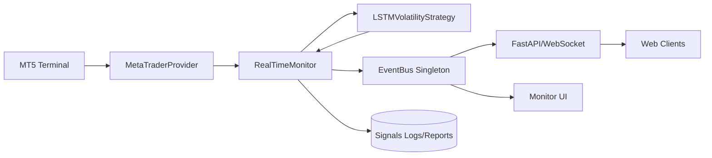
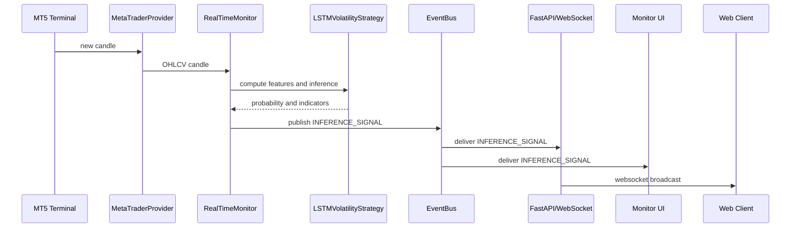

# WTNPS-FINADV - Architecture Plan

## Executive Summary
This document defines the target event-driven architecture for WTNPS-FINADV, with a centralized EventBus as the only communication path between Monitor, API, and UI. The goal is to remove direct coupling to internal buffers and callbacks, standardize event contracts, and strengthen reliability and observability.

## System Context

**Overview**
- Shows how operators, MT5, and UI clients interact with the core system.
**Key Components**
- RealTimeMonitor, EventBus singleton, FastAPI/WebSocket, Desktop GUI, external MT5 terminal.
**Relationships**
- MT5 feeds market data to the monitor; monitor publishes events; API and GUI consume events.
**Design Decisions**
- EventBus is the only integration path to prevent tight coupling.
**NFR Considerations**
- Scalability: multiple consumers can subscribe without modifying producers.
- Performance: in-process EventBus avoids network overhead.
- Security: UI access only via API/WebSocket or GUI, not internal buffers.
- Reliability: failures in a subscriber do not crash the producer.
- Maintainability: contracts are explicit and documented.
**Trade-offs**
- In-process bus limits cross-process distribution; acceptable for single-host deployment.
**Risks and Mitigations**
- Risk: inconsistent event schema across producers. Mitigation: canonical event contracts and validation.

## Architecture Overview
WTNPS-FINADV uses a modular monolith with an event-driven integration pattern. The RealTimeMonitor produces market data and inference signals, which are published to a centralized EventBus. Consumers (FastAPI/WebSocket and GUI) subscribe and react without direct access to internal buffers or callback hooks. This enforces clear contracts and reduces coupling.

## Component Architecture

**Overview**
- Shows the core runtime components and their responsibilities.
**Key Components**
- MetaTraderProvider (data), RealTimeMonitor (orchestration), Strategy (ML inference), Context Analyzer, EventBus, API/WebSocket, GUI, Logs/Reports.
**Relationships**
- Monitor pulls data, runs strategy/context, publishes events; API and GUI consume and broadcast.
**Design Decisions**
- Strategy is a pure ML component; adapters or UI logic must not bypass EventBus.
**NFR Considerations**
- Scalability: API and GUI can scale independently as subscribers.
- Performance: data processing stays in-memory; event payloads are minimal.
- Security: APIs do not read private buffers.
- Reliability: Monitor publishes even if GUI is disconnected.
- Maintainability: clear separation of data, inference, and presentation.
**Trade-offs**
- More integration discipline required; direct access is disallowed.
**Risks and Mitigations**
- Risk: event backpressure if subscribers are slow. Mitigation: decouple with lightweight handlers and queueing if needed.

## Deployment Architecture

**Overview**
- Describes a single-host deployment aligned with current execution model.
**Key Components**
- MT5 terminal, Python services, EventBus, API/WebSocket, GUI, local storage.
**Relationships**
- MT5 feeds the monitor; monitor publishes events to API and GUI; API serves browsers.
**Design Decisions**
- Single-host deployment reduces latency for real-time monitoring.
**NFR Considerations**
- Scalability: vertical scaling on a single host; future split possible with external bus.
- Performance: minimal network hops.
- Security: local-only MT5 integration; API can restrict origins.
- Reliability: process supervision can restart API or monitor.
- Maintainability: clear service grouping inside one runtime.
**Trade-offs**
- Limited horizontal scaling until EventBus is externalized.
**Risks and Mitigations**
- Risk: single point of failure. Mitigation: monitoring and restart policies.

## Data Flow

**Overview**
- Shows how market data and inference signals move through the system.
**Key Components**
- Provider, Monitor, Strategy, EventBus, API, GUI, Logs.
**Relationships**
- Data flows MT5 -> Provider -> Monitor -> Strategy; Monitor emits events to EventBus.
**Design Decisions**
- Event-driven publishing is the only path to consumers, preventing buffer access.
**NFR Considerations**
- Scalability: multiple subscribers to the same event stream.
- Performance: minimized payloads and in-memory processing.
- Security: no direct buffer exposure.
- Reliability: logging of signals is independent of UI.
- Maintainability: data flow is explicit and documented.
**Trade-offs**
- Requires event schema governance and validation.
**Risks and Mitigations**
- Risk: schema drift between producers and consumers. Mitigation: enforce canonical contracts and tests.

## Key Workflows

**Overview**
- Describes the real-time inference flow from MT5 to UI consumers.
**Key Components**
- Provider, Monitor, Strategy, EventBus, API/WebSocket, GUI, Browser.
**Relationships**
- EventBus fan-out ensures all consumers receive the same signal.
**Design Decisions**
- Monitor does not call UI directly; it publishes a canonical event instead.
**NFR Considerations**
- Scalability: add more subscribers without changing monitor logic.
- Performance: single publish with multiple subscribers.
- Security: API clients only see event payloads, not internal buffers.
- Reliability: GUI or browser failures do not block inference.
- Maintainability: flow is consistent across live and replay modes.
**Trade-offs**
- Event ordering is in-process; distributed ordering is out of scope.
**Risks and Mitigations**
- Risk: slow consumers could block event handling. Mitigation: lightweight handlers and optional async queue.

## Phased Development (if applicable)

### Phase 1: Initial Implementation
- Replace local EventBus in monitor with the singleton.
- Remove `ui_callback` and buffer access from GUI and API.
- Publish `MARKET_DATA_CANDLE` and `INFERENCE_SIGNAL` with canonical fields.

### Phase 2+: Final Architecture
- Add event validation and schema versioning.
- Introduce buffering/queueing for slow consumers.
- Evaluate external EventBus (Redis/NATS) if multi-host scaling is needed.

### Migration Path
- Implement the Phase 1 changes with feature parity, then add validation and queueing behind feature flags.

## Non-Functional Requirements Analysis

### Scalability
- EventBus enables fan-out; for multi-host scaling, plan an external bus.

### Performance
- In-memory publish/subscribe keeps latency low for real-time monitoring.

### Security
- UI/API consumers only receive event payloads; internal buffers stay private.

### Reliability
- Producer and consumers are decoupled; a failing subscriber does not halt the monitor.

### Maintainability
- Canonical event contracts and a single EventBus reduce duplication and ambiguity.

## Risks and Mitigations
- Schema drift: enforce a single canonical contract and validate before publish.
- Silent subscriber failure: add structured logging and health metrics for handlers.
- MT5 connectivity dependency: fail fast and expose clear errors to operators.

## Technology Stack Recommendations
- Keep FastAPI + WebSocket for live updates.
- Maintain EventBus singleton for single-host; evaluate Redis Pub/Sub or NATS for multi-host.
- Use JSON schema validation for event payloads.

## Next Steps
- Implement EventBus centralization and remove direct buffer access.
- Update API and GUI consumers to use only events.
- Add tests or smoke checklist covering /charts rendering and websocket updates.
